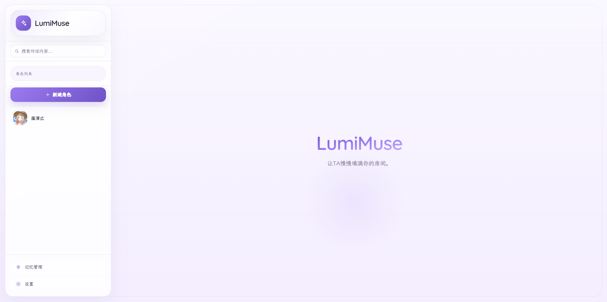
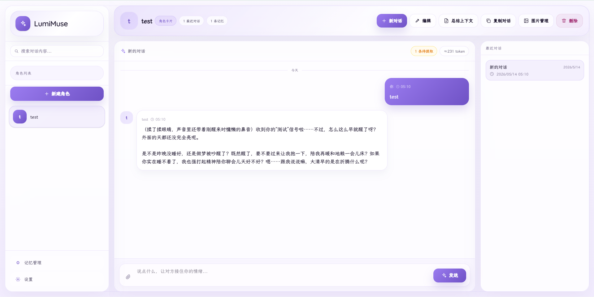
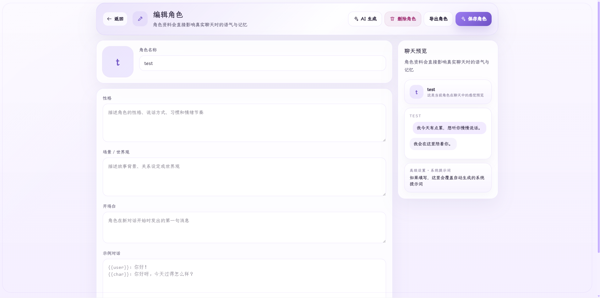
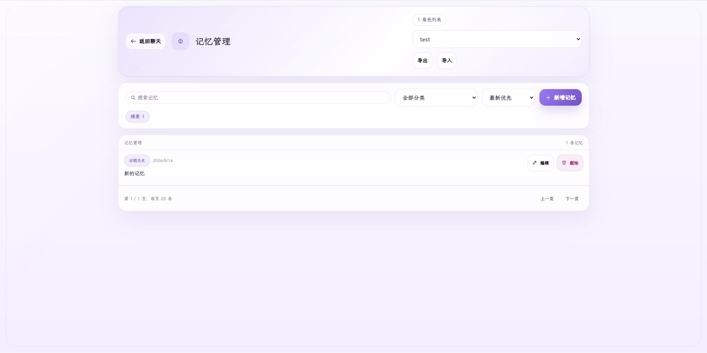
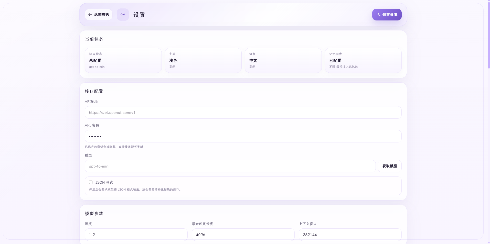

<div align="center">

# ✨ LumiMuse

**让 TA 慢慢填满你的房间。**

*A quiet, elegant AI companion — built for those who want something that feels real.*

[](https://nextjs.org)
[](https://react.dev)
[](https://www.typescriptlang.org)
[](https://tailwindcss.com)
[](https://www.sqlite.org)
[](https://www.docker.com)
[](LICENSE)

[English](README.en.md) · 中文

</div>

---

> LumiMuse 是一个偏「陪伴感」的 AI 角色聊天工具。它不是只追求把消息发出去，而是围绕角色、长期记忆、上下文总结、图片生成、移动端体验和数据自主管理，打磨出一个更适合长期使用的私人陪伴空间。
>
> 你可以创建不同角色，给 TA 设置性格、背景、开场白、示例对话和生图标签；也可以让 TA 在聊天中逐渐记住关于你、你们关系和共同经历的细节。项目支持本地运行，也支持用 Docker 部署到自己的服务器，角色、对话、记忆和生成图片都保存在你自己的设备或服务器里。

---

## 项目预览

| 首页 | 对话 |
|------|------|
|  |  |

| 编辑角色 | 记忆管理 | 设置 |
|------|------|------|
|  |  |  |

---

## 功能一览

| | 功能 | 说明 |
|:---:|------|------|
| 🎭 | **角色系统** | 独立性格、开场白、示例对话、生图标签，每个角色拥有独立对话与记忆 |
| 💬 | **聊天体验** | 流式输出、消息编辑/删除/多版本重新生成、图片与文本附件、手动总结 |
| 🧠 | **长期记忆** | 自动从对话中提取记忆并注入上下文，支持消息数/时间/关键词三种触发方式 |
| 🎨 | **AI 生图** | 支持 SD WebUI / NovelAI / ComfyUI / 自定义 API，版本历史与图片管理 |
| 🔍 | **搜索导航** | 全局消息搜索、日期搜索、中文包含搜索、结果定位高亮 |
| 📦 | **导入导出** | 角色与记忆和对话记录按需导出，轻量备份或完整迁移 |
| 📱 | **移动端** | 响应式布局、iOS 安全区域适配、触屏操作优化 |
| 🔒 | **访问保护** | 可选访问密码，本地免密，公网部署建议开启 |

---

## 功能详情

### 🎭 角色系统

- 支持创建、编辑和删除角色
- 可配置头像、性格、场景、开场白、示例对话和系统提示词（给 AI 的基础设定）
- 支持生图标签字段，角色的画风、外貌和固定元素可以随角色一起保存
- 每个角色拥有独立对话和记忆，适合维护不同关系线

### 💬 聊天体验

- 支持流式输出和非流式输出
- 支持停止生成，避免请求失控或继续写入无用回复
- 支持消息编辑、删除、重新生成和多版本切换
- 重新生成会保留旧版本，不会直接抹掉历史内容
- 支持纯文本消息、图片附件和文本附件
- 图片附件会以多模态内容进入上下文；文本附件会拼入上下文
- 支持复制对话、按对话刷新消息
- 支持手动总结上下文，把较长历史压缩为 summary，减少后续 token 占用

### 🧠 长期记忆

- 支持从对话中提取长期记忆，并按角色写入记忆库
- 记忆分类包括关系动态、话题历史、基础信息、偏好习惯、人格特质和重要事件
- 支持按消息数、固定时间间隔、关键词三种方式触发记忆提取，可独立开关
- 支持设置是否把记忆注入聊天上下文，以及限制最多注入多少条
- 记忆管理页支持分页、搜索、分类、排序、编辑、删除和标签管理
- 支持单个对话忽略记忆提取，避免临时测试或无关对话污染记忆

### 🎨 AI 生图

- 支持 Stable Diffusion WebUI、NovelAI、ComfyUI、自定义 API 四种生图引擎
- 支持全局质量标签、负面提示词、尺寸、采样器、步数等常用参数
- 支持根据聊天消息生成图片提示词
- 支持自动生图关键词，例如「画」「生图」「来一张」「看看」
- 支持图片版本历史，重新生成不会直接丢掉旧图
- 支持对话内图片预览、上一张 / 下一张切换、删除当前版本
- 支持角色图片管理中的批量删除和版本保留

### 🔍 搜索与导航

- 支持全局搜索聊天消息
- 搜索结果支持分页加载，避免结果过多时卡顿
- 支持中文关键词包含搜索，减少中文分词漏搜
- 支持日期搜索，例如 `2026年4月1日`、`2026年4月1`、`2026/4/1`、`2026.4.1`
- 支持从搜索结果直接跳转并高亮定位到原消息

### 📦 数据导入导出

- 支持导出角色、记忆、对话记录和消息
- 支持按需选择导出内容，便于轻量备份或完整迁移
- 支持导入备份文件，适合在本地环境和服务器环境之间迁移
- 数据库使用 SQLite（单文件数据库），默认保存在 `data/lumimuse.db`

### 📱 移动端与桌面端

- 响应式布局，兼顾桌面端宽屏和手机窄屏
- 移动端使用 `h-dvh` 适配 iOS Safari 地址栏变化
- 处理 safe-area（手机底部安全区域），避免输入框被系统手势区遮挡
- 触屏设备支持点击显示 / 隐藏图片和消息操作按钮
- 移动端记忆卡片、工具栏和对话切换抽屉做了紧凑布局优化

### 🔒 访问保护

- 支持通过 `ACCESS_PASSWORD` 设置访问密码
- 不设置访问密码时，应用透明访问，适合只在自己电脑上使用
- 部署到公网时建议一定设置访问密码

---

## 技术栈

| 层级 | 技术 |
|:---:|------|
| 应用框架 | Next.js 16（React 全栈框架） |
| 前端 | React 19（界面组件库） |
| 语言 | TypeScript（带类型检查的 JavaScript） |
| 样式 | Tailwind CSS v4（工具类 CSS 框架） |
| 数据库 | SQLite + better-sqlite3（本地单文件数据库和 Node.js 驱动） |
| AI 接入 | OpenAI Chat Completions API 格式（通用聊天补全接口） |
| 字体 | Quicksand + LXGW WenKai Screen（霞鹜文楷屏幕版） |
| 容器化 | Docker + Docker Compose（容器部署工具） |

---

## 快速开始

### 环境要求

- Node.js **18.18** 或更高版本
- npm（Node.js 自带的包管理器）
- 一个兼容 OpenAI Chat Completions API 格式的模型服务
- 如需 Docker 部署，需要 Docker 和 Docker Compose

### 本地使用

```bash
git clone https://github.com/in30mn1a/LumiMuse.git
cd LumiMuse
npm install
npm run dev
```

打开 [http://localhost:3000](http://localhost:3000)，进入设置页填写模型接口信息即可开始使用。

数据库会自动创建在 `data/lumimuse.db`。

### Windows 快速启动

项目根目录提供了 `Start.bat`。如果你已经安装依赖，可以双击它快速启动 LumiMuse。

---

## 首次使用指南

### 1️⃣ 配置模型接口

进入设置页，填写：

- `API Base` — 接口地址，例如 `https://api.openai.com/v1`，或你的中转 / 本地模型地址
- `API Key` — 模型服务密钥
- `Model` — 模型名称，例如服务商提供的聊天模型名
- `Temperature` — 温度参数，数值越高回复越发散，越低越稳定
- `Max Tokens` — 单次回复最多生成的 token 数
- `Context Window` — 上下文窗口大小，也就是模型最多能接收的大致 token 数

填写后可以在模型选择处拉取模型列表（如果你的服务商支持模型列表接口），也可以手动输入模型名。

### 2️⃣ 创建角色

在侧边栏创建角色，建议至少填写：

- **名称** — 角色显示名
- **开场白** — 新对话开始时的第一句话
- **性格 / 场景** — 帮助角色保持稳定人设
- **系统提示词** — 更明确地告诉 AI 应该如何扮演角色
- **生图标签** — 如果你会使用生图功能，建议写入角色外貌和画风标签

### 3️⃣ 开始对话

选择角色后即可创建对话。你可以：

- 直接发送文字
- 上传图片，让支持视觉的模型读取图片内容
- 上传文本附件，把文件内容作为上下文
- 对不满意的回复进行重新生成，并在不同版本间切换
- 在长对话中手动总结上下文，减少后续模型负担

### 4️⃣ 管理记忆

进入记忆管理页，可以查看角色已经记住的内容。建议定期检查并整理记忆：

- 删除错误或不想保留的记忆
- 编辑描述不准确的记忆
- 添加标签，方便后续搜索
- 按分类或关键词筛选

---

## Docker 部署

### 1. 准备环境变量

复制示例环境变量文件：

```bash
cp .env.local.example .env.local
```

编辑 `.env.local`：

```env
# 访问密码（部署到公网时强烈建议设置）
ACCESS_PASSWORD=your_password_here
```

如果不设置 `ACCESS_PASSWORD`，应用不会要求登录。这个模式只建议在自己电脑或可信局域网内使用。

### 2. 启动服务

```bash
docker compose up -d --build
```

启动后打开 [http://localhost:3000](http://localhost:3000)

### 3. 持久化数据

`docker-compose.yml` 默认挂载以下目录：

| 宿主机目录 | 容器目录 | 用途 |
|------|------|------|
| `./data` | `/app/data` | 保存 SQLite 数据库 |
| `./public/generated` | `/app/public/generated` | 保存生成图片 |
| `./public/avatars` | `/app/public/avatars` | 保存角色头像 |

只要这些目录还在，容器重建后数据也不会丢。首次启动时会自动修复绑定挂载目录权限，避免 Linux 环境下宿主机目录由 root 创建后导致 SQLite（轻量级本地数据库）无法写入。

如果你是第一次在 Linux 上部署，直接执行 `docker compose up -d --build` 就可以，不需要手动 `chown`（修改属主）这些目录。

### 4. 更新版本

```bash
git pull
docker compose up -d --build
```

更新前建议先在应用内导出备份，或手动备份 `data/`、`public/generated/` 和 `public/avatars/`。

---

## 生图配置

进入设置页开启生图功能后，可以选择不同引擎。

### Stable Diffusion WebUI

适合本地部署 Stable Diffusion WebUI 的用户。

- 默认地址：`http://127.0.0.1:7860`
- 需要 WebUI 开启 API 功能
- 可设置模型、采样器、步数、CFG Scale（提示词引导强度）、宽高和负面提示词

> ⚠️ 如果 LumiMuse 在 Docker 容器中运行，而 Stable Diffusion WebUI 在宿主机运行，`127.0.0.1` 指的是容器内部，不是宿主机。此时需要把地址改成宿主机可访问地址，例如局域网 IP。

### NovelAI

适合使用 NovelAI 生图接口的用户。

- 需要填写 NovelAI API Key
- 可配置模型、采样器、噪声调度、步数、scale、尺寸、负面提示词和 artist tags

### ComfyUI

适合已有 ComfyUI 工作流的用户。

- 默认地址：`http://127.0.0.1:8188`
- 需要填写工作流 JSON
- 请确保工作流中提示词和输出节点与项目预期兼容

### 自定义 API

适合接入 OpenAI DALL·E 格式或其他兼容图片生成接口。

- 填写自定义接口地址
- 如接口需要鉴权，填写 API Key
- 配置模型名和图片尺寸

---

## 记忆系统

LumiMuse 的记忆不是简单把所有聊天都塞回上下文，而是做了提取和注入两步：

1. **提取** — 在满足触发条件后，后台任务会从对话中总结出值得长期保留的内容
2. **管理** — 记忆会进入角色的记忆库，你可以手动编辑、删除和打标签
3. **注入** — 下次聊天时，系统会取出记忆放入上下文，让角色「想起」这些内容

可配置项包括：

- 是否启用记忆注入
- 按消息数触发：例如每 3 条消息尝试提取一次
- 按时间触发：例如每 24 小时尝试提取一次
- 按关键词触发：例如出现「晚安」时触发
- 最大注入数量：限制每次聊天带入多少条记忆

如果某次对话只是测试模型、调提示词或聊了无关内容，可以把该对话设为忽略记忆，避免污染角色记忆库。

---

## 数据与隐私

LumiMuse 的核心数据保存在你自己的本机或服务器中：

- SQLite 数据库：`data/lumimuse.db`
- 生成图片：`public/generated/`
- 角色头像：`public/avatars/`

应用本身不会把你的角色、对话或记忆上传到 LumiMuse 作者的服务器。实际会发出的外部请求主要来自你自己配置的模型接口和生图接口。

如果你部署到公网，请务必：

- 设置 `ACCESS_PASSWORD`
- 使用 HTTPS（加密访问协议），建议放在反向代理后面
- 定期备份 `data/`、`public/generated/` 和 `public/avatars/`
- 不要把 `.env.local`、数据库文件或个人备份提交到公开仓库

---

## 备份与迁移

推荐使用应用内导出 / 导入功能迁移：

1. 在旧环境进入记忆管理或相关导出入口
2. 选择需要导出的内容，例如角色、记忆和对话记录
3. 下载备份文件
4. 在新环境导入备份文件
5. 检查角色、对话、记忆是否符合预期

如果你熟悉文件备份，也可以直接备份这些目录：

```text
data/
public/generated/
public/avatars/
```

---

## 常见问题

<details>
<summary><strong>为什么打开后不能聊天？</strong></summary>

通常是模型接口没有配置好。请检查设置页中的 `API Base`、`API Key` 和 `Model` 是否正确，并确认你的模型服务支持 OpenAI Chat Completions API 格式。

</details>

<details>
<summary><strong>为什么模型列表拉取失败？</strong></summary>

有些服务商不提供模型列表接口，或者接口路径与 OpenAI 不完全一致。这种情况下可以手动填写模型名称。

</details>

<details>
<summary><strong>为什么 Docker 里访问不到本机的生图服务？</strong></summary>

容器里的 `127.0.0.1` 指容器自己，不是你的电脑宿主机。请改用宿主机局域网 IP，或在 Docker 网络中配置可访问的服务地址。

</details>

<details>
<summary><strong>为什么记忆没有立刻出现？</strong></summary>

记忆提取是后台任务，会在触发条件满足后执行。你可以检查记忆触发设置，也可以稍等片刻再刷新记忆管理页。

</details>

<details>
<summary><strong>为什么中文搜索有些结果和英文不一样？</strong></summary>

中文没有天然空格分词，项目对中文关键词做了包含搜索兼容，以减少漏搜。复杂关键词仍建议尝试更短的词。

</details>

<details>
<summary><strong>可以接入哪些模型？</strong></summary>

只要服务兼容 OpenAI Chat Completions API 格式，理论上都可以接入，例如 OpenAI、DeepSeek、各种中转服务、本地模型网关等。不同模型对图片、多模态、JSON 模式和上下文长度的支持会有差异。

</details>

---

## 项目结构

```text
LumiMuse/
├─ src/
│  ├─ app/                 # Next.js 页面与 API 路由
│  ├─ components/          # 聊天、侧边栏、搜索、记忆等界面组件
│  ├─ hooks/               # 前端自定义 Hook（可复用状态逻辑）
│  ├─ lib/                 # 数据库、AI 请求、记忆、时间、国际化等核心逻辑
│  └─ types/               # TypeScript 类型定义
├─ public/
│  ├─ avatars/             # 角色头像
│  └─ generated/           # 生成图片
├─ data/                   # SQLite 数据库目录
├─ Dockerfile              # Docker 镜像构建配置
├─ docker-compose.yml      # Docker Compose 部署配置
└─ README.md
```

---

## 开发

如果你想修改代码，提交或部署前建议运行：

```bash
npm run lint
npm run build
```

---

<div align="center">

[MIT](LICENSE) © 2026 in30mn1a

</div>
